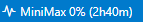

# VSCode MiniMax Usage

<div align="center">



[](https://github.com/Piyabordee/minimax-usage/releases/latest)
[](https://github.com/Piyabordee/minimax-usage/commits/main)
[](LICENSE)

<!-- markdownlint-disable-next-line -->
### Display your [MiniMax Token Plan](https://platform.minimax.io/docs/token-plan/faq) usage percentage directly in the VS Code status bar

## Why this extension?

Most existing VS Code extensions for AI usage tracking don't support MiniMax's token plan API. This extension fills that gap by directly calling `https://www.minimax.io/v1/token_plan/remains` to show your real-time usage in the status bar.

</div>

## Features

- Shows token quota usage (e.g. `45% (2h30m)`) or remaining tokens (e.g. `55% (2h30m)`) in the status bar
- Displays time remaining until quota resets when available
- Automatically refreshes at a configurable interval
- Secure API key storage via VS Code Secret Storage

**Status bar examples:**

|           Situation            |     Display     |
| ------------------------------ | --------------- |
| Authenticated, usage available | `⚡ MiniMax 45% (2h30m)` |
| Authenticated, no reset time   | `⚡ MiniMax 45%` |
| Authenticated, remaining mode   | `⚡ MiniMax 55% (2h30m)` |
| API key not set                | `🔑 MiniMax: Set API Key` |
| Error / fetch failed           | `⚠️ MiniMax: Error` |

## Setup

1. Get your Token Plan Key from the [MiniMax Platform](https://platform.minimax.io/docs/token-plan/faq)
2. Open the Command Palette (`Cmd+Shift+P` / `Ctrl+Shift+P`)
3. Run **MiniMax Usage: Set API Key** and paste your token
4. The status bar will update immediately

## Commands

|           Command           |             Description              |
| --------------------------- | ------------------------------------ |
| `MiniMax Usage: Set API Key`   | Enter and verify your MiniMax Token Plan Key |
| `MiniMax Usage: Clear API Key` | Remove the stored API token          |
| `MiniMax Usage: Refresh`       | Manually refresh usage data          |
| `MiniMax Usage: Show Details`  | Display detailed usage information   |

## Settings

|          Setting           |   Type    | Default |                                     Description                                      |
| -------------------------- | --------- | ------- | ------------------------------------------------------------------------------------ |
| `minimaxUsage.refreshIntervalMinutes` | `number`  | `5`     | Data refresh interval in minutes                                               |

## Requirements

- VS Code 1.85.0 or higher
- A valid MiniMax Token Plan Key

## Installation

### Method 1: Install from .vsix file
1. Download the `.vsix` file from [Releases](https://github.com/Piyabordee/minimax-usage/releases/latest)
2. In VS Code: go to **Extensions** → press **...** (three dots) → **Install from VSIX...**
3. Select the downloaded `.vsix` file
4. Press **Reload Window** when prompted

### Method 2: Via Command Line
```bash
code --install-extension minimax-usage-x.x.x.vsix
```

## Build from source

```bash
# Install vsce (once)
npm install -g vsce

# Package extension
vsce package
```

This creates `minimax-usage-X.X.X.vsix` ready for installation.

## API

- **Endpoint:** `GET https://www.minimax.io/v1/token_plan/remains`
- **Auth:** `Authorization: Bearer <Token Plan Key>`

## License

> [!WARNING]
> This extension uses an internal MiniMax API (`www.minimax.io/v1/token_plan/remains`) which is not officially documented. The API may change without notice, which could break this extension.

MIT